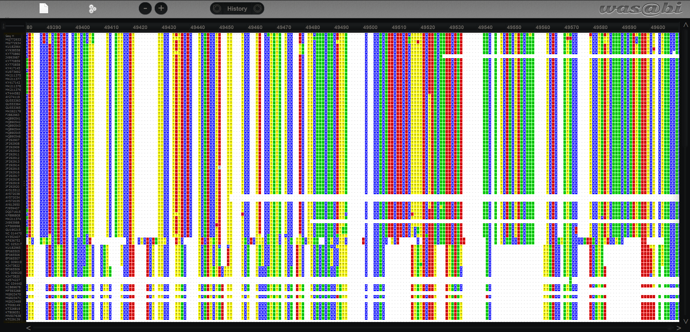

# Multiple sequence alignment and phylogenetic tree construction
## This project aims to determine the origin of the COVID-19 virus using multiple sequence alignment and phylogenetic tree construction
## To achieve this, we will *detail steps here*
### This project's completion is attributed to my successful completion of the BIS180L course during my attendance at UC Davis. The course materials and resources were provided by Dr. Julin Maloof and can be found on the BIS180L course GitHub page hosted at https://jnmaloof.github.io/BIS180L_web/.


First we acquire the sequences to complete the analysis.

```sh
wget https://bis180ldata.s3.amazonaws.com/downloads/Assignment4/selected_viral_seqs_195v2.fa -P output/
```
## Create Alignments
For the multiple sequence alignment we will use MAFFT.

```sh
#MAFFT installation within Linux kernel
sudo apt install mafft
```

```sh
#Run MAFFT
time mafft --maxiterate 100 --thread 3 --reorder --op 0.5 selected_viral_seqs_195v2.fa  > mafft_maxiter100_195_op.5.fa
```

To view the genome alignments created by MAFFT we will use the in-browser viewer [Wasabi](was.bi).



## Subset sequences in R-Studio


```{r,eval = True}
library(tidyverse)
library(Biostrings)
```


```{r}
inpath <- "output/mafft_maxiter100_195v2_op.5.fa"
outpath <- "output/mafft_maxiter100_195v2_op.5_trimmed_75pct.fa"
alignment <- readDNAMultipleAlignment(inpath)
alignment
```


```{r}
#Trim the beginning and ends with incomplete sequences
alignment <- DNAMultipleAlignment(alignment,start=1000,end=48449)

#Mask sites that contain more than 25% gaps
alignment <- maskGaps(alignment, min.fraction=0.25, min.block.width=1)
maskedratio(alignment) #what proportion got masked? (rows and columns)
```

```{r}
#Change alignments into a stringset to more easily manipulate the names
alignment <- alignment %>% as("DNAStringSet") 
```

```{r}
newnames <- names(alignment) %>% 
  tibble(name=.) %>%
  mutate(name=str_replace_all(name," ","_")) %>% #replace " " with "_" because some programs truncate name at " "
  separate(name, 
           into=c("acc", "isolate", "complete", "name", "country", "host"),
           sep="_?\\|_?") %>%
  mutate(name=str_replace(name, "Middle_East_respiratory_syndrome-related","MERS"),   # abbreviate
         name=str_replace(name, "Severe_acute_respiratory_syndrome-related", "SARS"), # abbreviate
         newname=paste(acc,name,country,host,sep="|")) %>% # select columns for newname
  pull(newname) #return newname
```

```{r}
head(newnames)
```

```{r}
names(alignment) <- newnames
alignment %>% writeXStringSet(outpath)
```


```{bash}
#Create a phylogenetic tree from the subsetted sequences
FastTree -nt -gtr -gamma -out output/mafft_maxiter100_195v2_op.5_trimmed.fasttree.tre output/mafft_maxiter100_195v2_op.5_trimmed_75pct.fa
```

The phylogenetic tree can be viewed at the in-browser tool [iTol](https://itol.embl.de/)


# Results

A: What is the sister taxon to Seq_H? (there will be two taxa in this group) What is the host for the virus in this group (provide the Latin and common names)
hint: if you are having trouble finding Seq H in the tree, search for it using the (Aa) magnifying glass
* Seq H has SARS Coronavirus within its taxon and Bat Coronavirus and as sister taxa, putting it well within range for the genetic classification of a Coronavirus.

B: Consider Seq_H plus its sister taxa as defining one taxonomic group with three members. Look at the sister taxon of this group (it is a large group). What is a general description for the viruses in this sister group? List at least 3 different hosts found in this group. Give Latin and common names (if there is a common name).

C: Now consider Seq_H plus all of the other taxa used in question B as one taxonomic group. The sister to this group has three members. What are the hosts of this group?

D: Given your above findings, what do you think the host of the most recent common ancestor to the viruses in parts A and B was? (You can answer giving the common name for the general type of organism, e.g. rat, mouse, bat, ape, etc. you do not need to give a precise species).

E: Do you think that Seq_H evolved from a virus with a human host? Why or why not? If not, what did it evolve from?